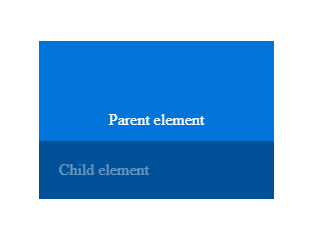

## Tạo file index.html hiển thị giao diện như hình dưới

```
  <body>
    <div class="parent">
      Parent element
      <div class="element">Child element</div>
    </div>
  </body>
```

Sử dụng Position absolute và relative

