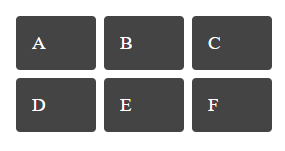

## Với đoạn HTML dưới, hãy viết CSS để tạo được grid như hình

```
<div class="wrapper">
  <div class="box a">A</div>
  <div class="box b">B</div>
  <div class="box c">C</div>
  <div class="box d">D</div>
  <div class="box e">E</div>
  <div class="box f">F</div>
</div>
```



### Hướng dẫn:
Sử dụng
```
grid-template-columns
```
Columns với đúng tên gọi là cột. Khi sử dụng thuộc tính này, grid container sẽ chia các items con bên trong thành các cột. Bạn muốn chia bao nhiêu cột cũng được. Ví dụ mình có 10 items, mình muốn chia 1 hàng có 5 cột. Đơn vị ở đây các bạn có thể dùng px, %, rem, em, vw, vh, auto. Ngoài ra với flex bạn có thể dùng đơn vị fr dùng để phân bố các items có size có tỉ lệ với nhau.
```
.container {
	grid-template-columns: 20% 20% 20% 20% 20%;
}
.container {
	grid-template-columns: 200px 300px 100px 50px auto;
}
```

Trích dẫn [tại đây](https://viblo.asia/p/hieu-ve-css-grid-layout-phan-1-naQZRA6GKvx)