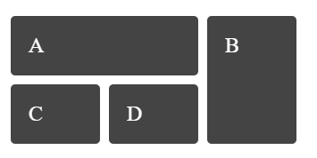

## Với đoạn HTML dưới, hãy viết CSS để tạo được grid như hình

```
<div class="wrapper">
  <div class="box a">A</div>
  <div class="box b">B</div>
  <div class="box c">C</div>
  <div class="box d">D</div>
</div>
```

