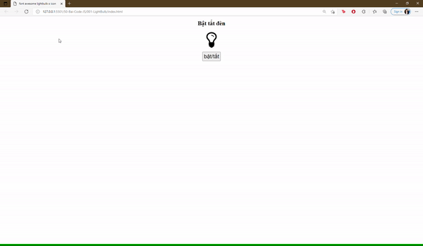

## Với đoạn HTML dưới, hãy viết CSS + JS để được như hình

```
<h1>Bật tắt đèn</h1>

    <p>
      <i
        class="fa fa-lightbulb-o"
        id="light-switch"
        style="font-size: 100px"
      ></i>
    </p>
    <button id="btn" style="width: 100px; height: 50px; font-size: 30px">
      bật/tắt
    </button>
```


