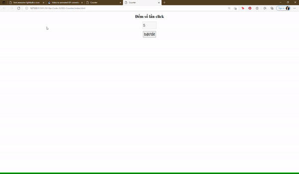

## Với đoạn HTML dưới, hãy viết CSS + JS để được như hình

```
<h1>Đếm số lần click</h1>

    <p>
      <input disabled value="0" type="number" name="" style="width: 100px; height: 50px; font-size: 30px" id="counter">
    </p>
    <button id="btn" style="width: 100px; height: 50px; font-size: 30px">
      bật/tắt
    </button>
```


