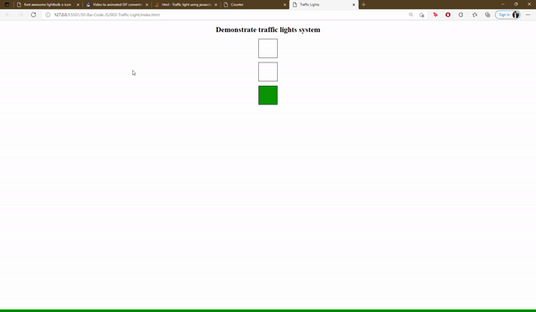

## Với đoạn HTML dưới, hãy viết CSS + JS để được như hình

```
    <p>Demonstrate traffic lights system</p>

    <div
      id="div1"
      style="
        width: 80px;
        height: 80px;
        background-color: white;
        border: 1px solid #000;
      "
    ></div>
    <br />
    <div
      id="div2"
      style="
        width: 80px;
        height: 80px;
        background-color: white;
        border: 1px solid #000;
      "
    ></div>
    <br />
    <div
      id="div3"
      style="
        width: 80px;
        height: 80px;
        background-color: white;
        border: 1px solid #000;
      "
    ></div>
```


