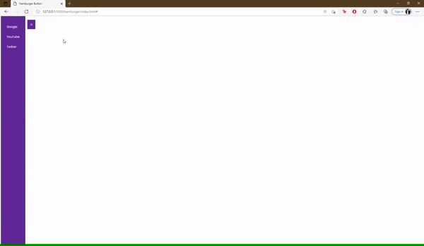

## Với đoạn HTML dưới, hãy viết CSS + JS để được như hình

```
<button id="btn">☰</button>

        <nav id="nav">
            <ul>
                <li><a href="#">Google</a></li>
                <li><a href="#">YouTube</a></li>
                <li><a href="#">Twitter</a></li>
            </ul>
        </nav>
```


